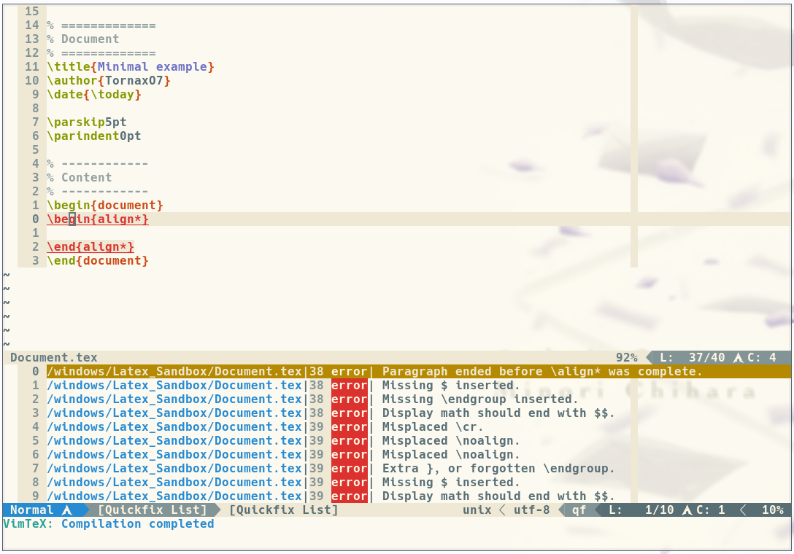

# Documentation

Welcome to the high-level documentation of VimTeX.

This file should help you to understand the structure of this plugin and how
it works.

So first of all, we're taking a look into the first layer of the plugin, after
that, we're going to through each necessary directory, if it needs some more
description. We won't go through _every_ file, because it would take a little
bit too long the most should be probably self explained.

This file works as follows:
The table of contents has the same structure as the file structure of
VimTeX. If you want to know something about the
`vimtex/autoload/vimtex/compiler` directory, than you can lookup the path in the
table of contents and click on it. (Hopefully) It'll give you some nice
information.

<!-- START doctoc generated TOC please keep comment here to allow auto update -->
<!-- DON'T EDIT THIS SECTION, INSTEAD RE-RUN doctoc TO UPDATE -->


- [ftplugin](#ftplugin)
- [syntax](#syntax)
- [indent](#indent)
- [after/ftplugin](#afterftplugin)
- [autoload](#autoload)
  - [health](#health)
  - [unite/sources](#unitesources)
  - [vimtex](#vimtex)
    - [delim.vim](#delimvim)
    - [cache.vim](#cachevim)
    - [compiler](#compiler)
    - [debug.vim](#debugvim)
    - [complete (dir)](#complete-dir)
      - [tools](#tools)
    - [context](#context)
    - [fold](#fold)
    - [parser](#parser)
    - [qf](#qf)
    - [syntax](#syntax-1)
    - [text_obj](#text_obj)
    - [view](#view)
- [rplugin/python3/denite/source/vimtex.py](#rpluginpython3denitesourcevimtexpy)
- [test](#test)

<!-- END doctoc generated TOC please keep comment here to allow auto update -->

# ftplugin
Well nothing really big to say here: If you open a `bib` or `tex` tiletype
it'll look, if you have VimTeX has been loaded.

# syntax
The main file which loads the syntax highlighting settings according to its
needs because all syntax rules might wouldn't be worth it.

# indent
The main function is `VimtexIndent` which returns the indent of the next line
you're writing. If you want to know how it's doing that, take a look into this
function!

# after/ftplugin

Currently there's only one file in it which makes sure that VimTeX loaded
successfully and that there're no conflicts with other plugins like LaTeX-Box.

# autoload

If you want to know more about the *special functionality* of the `autoload`
directory, you can read the `:h autoload` section or take a little look into
[this chapter](https://learnvimscriptthehardway.stevelosh.com/chapters/42.html)
of [Learn Vimscript the Hard
Way](https://learnvimscriptthehardway.stevelosh.com/chapters/42.html) by Steve
Losh.

## health

This directory has the following health-checks functions:

- If the user has a valid vim version
- If the user selected a valid compiler
- If their might be any plugin-clashes.
- If the user has the needed dependencies for their PDF-Viewer

**HINT:**** This file uses some functions provided by the `health.vim` framework
which is only available for `neovim`!

## unite/sources

This directory is used to combine VimTeX with
[denite](https://github.com/Shougo/denite.nvim) or
[unite](https://github.com/Shougo/unite.vim). These extra-plugins are mainly
used to list the TOC of your current document. Take a look into `:h vimtex-unite`, to get more information.

## vimtex

This directory has the main files. Each file should be self-explaining but here
are some files which might be good to know!

## vimtex.vim

This file includes the main function: `vimtex#init()` which loads all the
functionalities from all other files and modules.

### delim.vim

This file includes some functions to detect the surrounding delimiters like
this:

```tex
\begin{Environment}
  Some awesome text |
\end{Environment}
```

The vertical line (`|`) should represent your cursor. Now you could use the
`vimtex#delim#get_surrounding('env_tex')` function in order to get the current
environment where the user is. Here's an example code:

```vim
" Return values are dictionaries
let [l:open, l:close] = vimtex#delim#get_surrounding('env_tex')

" Empty dicts mean we did not find a surrounding environment
if empty(l:open) | return | endif

" The dicts have several attributes, the most important are probably these:
echo l:open.name
echo l:open.lnum
echo l:open.cnum
```

For more information, take a look into [this
issue](https://github.com/lervag/vimtex/issues/1981#issuecomment-792263781).

### cache.vim
This file includes some functions to create and access your own caches.
Here's an example:

```vim
function VimTeXCacheExample()
  " create a new cache (if the name doesn't exist yet)
  " with an attribute 'number'. So the cache would be like that:
  "
  "   let l:test = {
  "   'number' = 10,
  "   }
  let l:my_cache = vimtex#cache#open('cache_name', {'number' : 10})

  " change the value in you cache
  let l:my_cache['number'] = 9001

  " will print '9001'
  echo l:my_cache['number']

  " save your changes
  " In general it'll be saved in your `$XDG_CACHE_HOME/vimtex/` directory
  " (normally '~/.cache/vimtex') in the appropriate tex-file where you accessed
  " cache file.
  call vimtex#cache#close('cache_name')
endfunction
```

### compiler
As the directory names says: This directory includes the vim files to interact
with the given LaTeX compiler. Each file have similar function names like
`s:compiler.start`. You can take a look into these function to get a better
understanding how they work.

### compiler.vim
This file includes the main functions to interact with the given compiler in the
`vimtex/autoload/vimtex/compiler` directory, it also provides the commands like
`:VimtexCompile`. For example, the `vimtex#compiler#start()` function just calls
(if we selected the latexmk compiler) the `s:compiler_nvim.start_single()`
function of the `vimtex/autolaod/vimtex/compiler/latexmk.vim` file.

### debug.vim
This file is used for interal debugging and is not related to LaTeX at all. It
parses the stacktrace from the `v:throwpoint` variable (see `:h v:throwpoint`
for more information). If this does not exist, then we forcibly create
it and remove the top element.
You can try this code as an example:

```vim
function! Test() abort
  try
    throw "Error message is here :D"
  catch
    call vimtex#debug#stacktrace(1)
  endtry
endfunction
```
Now enter `:call Test()` and the quickfix window should pop up with the `"Error
message is here :D"` message.

### complete.vim
It includes a bunch of functions to filter out the information for the omnifunc
function of vim like getting the names of the custom-environments and loading
the given keywords of a package. Each section includes a function which takes
care for a given part of the omnicompletion.

The `complete` directory includes all keywords which are loaded for the given
package you're using in your `tex` file.

#### tools
This directory includes all glyphs like α and β.

### context.vim
The single file (`cite.vim`) is used for the `vimtex-context-citation` part.
[Here's](https://github.com/lervag/vimtex/pull/1961#issuecomment-795476750) a more detailed description of what it does and what's it's used for.

### fold.vim
This file includes the functions to create the foldings. The main function is
the `vimtex#fold#init_state(state)` function which is calling the needed fold
functions for the current section:

```vim
  " this is in line 43
  let a:state.fold_types_dict[l:key] = vimtex#fold#{l:key}#new(l:config)
```

The `vimtex/autoload/vimtex/fold` directory takes care of folding your `tex`
document like this thanks to the functions of each file:


The filenames in this directory represent what it folds.

### parser.vim
As the name of the file says: It's parsing the file we're currently editing. For
example it looks where the preamble stops or how the table of contents is
structured. Thanks to these information we're able to see a little TOC to
navigate in our file (`:h :VimtexTocToggle` for more information):


The `vimcomplete.bst` file is used by `parser/bib.vim` in the
`s:parse_with_bibtex()` function, which will actually run the bibtex problem
with the supplied `.bst` file in order to convert a `.bib` file to a `.bbl` file
that is much easier to parse.

### qf.vim
Here we're creating the entries for the quickfix window do display them. It
depends on which filetype we're currently editing. For example if we're editing
a `bib` file, than it's using the function in the
`vimtex/autoload/vimtex/qf/bibtex.vim` in order to create the appropriate
error/warning logs.

Here's an example which is generated through the `latexlog.vim`
file:


### syntax
This directory includes the syntax highlighting rules for each keyword in a
LaTeX file. But the *main* syntax-highlighting functionalities are in the
`syntax/core.vim` file which also includes the concealling characters starting
from line 745.

The `p` directory just includes more syntax highlighting rules which are *only*
loaded if they are needed.

### text\_obj.vim
This file includes some functions which can be used to get some information
about the current user position. `envtargets.vim` includes for instance some
functions like `vimtex#text_obj#envtargets#current` to get the current
environment where the user is.

### view.vim
In this file we're interacting with the given PDF-Viewer set by the
`g:vimtex_view_method` variable (like zathura). VimTeX is calling the
appropriate functions of the selected pdf-viewer.
In order to achieve that, it just use the `g:vimtex\_view\_method` variable to
get the (file)name in the `vimtex/autoload/vimtex/view` directory where all
files have the same function names. Just a different name according to the
compiler. So it looks like that (line is from the `vimtex#view#init_buffer()`
function):

```vim
  let a:state.viewer = vimtex#view#{g:vimtex\_view\_method}#new()
```

If `g:vimtex\_view\_method` would be `zathura`, we'd call the
`vimtex#view#zathura#new()` function which call zathura to open the PDF-file for
us.

# rplugin/python3/denite/source/vimtex.py
This file is used to interact with the
[denite.vim](https://github.com/Shougo/denite.nvim) plugin. For example to jump
to a section/subsection or chapter.

# test
This directory includes *all* test cases which have to pass in order to have a
stable and functional awesome VimTeX plugin :) Each directory and filename
should be self explaining for which cases they are used for.
