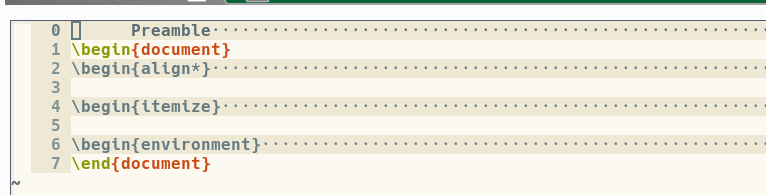
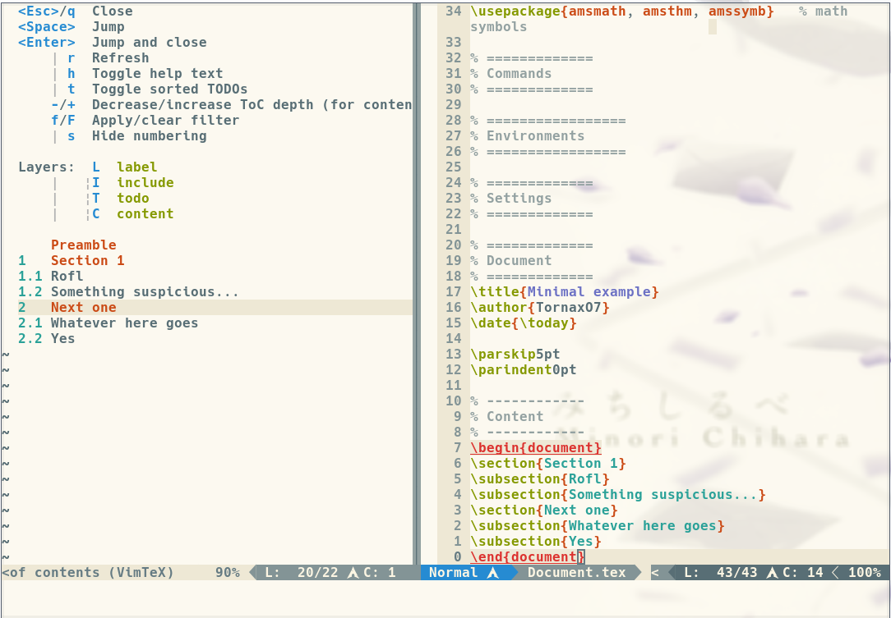

# Documentation

Welcome to the "high-level documentation" of VimTeX. The goal of this document
is to help developers (and curious users) to understand the structure of the
plugin and how it works. That is, it should essentially provide a useful and
quick overview of the most important files and directories. See also `:help
vimtex-code` for some related information.

The table of contents has the same structure as the essential file structure of
VimTeX. E.g., if you want to know something about
`vimtex/autoload/vimtex/somefile.vim`, then you can lookup the path in the
table of contents and click on it.

<!-- START doctoc generated TOC please keep comment here to allow auto update -->
<!-- DON'T EDIT THIS SECTION, INSTEAD RE-RUN doctoc TO UPDATE -->


- [ftplugin](#ftplugin)
- [syntax](#syntax)
- [indent](#indent)
- [after/ftplugin](#afterftplugin)
- [autoload](#autoload)
  - [vimtex.vim](#vimtexvim)
  - [vimtex](#vimtex)
    - [state.vim](#statevim)
    - [delim.vim](#delimvim)
    - [cmd.vim](#cmdvim)
    - [cache.vim](#cachevim)
    - [compiler.vim](#compilervim)
    - [compiler](#compiler)
    - [debug.vim](#debugvim)
    - [complete.vim](#completevim)
      - [tools](#tools)
    - [context.vim](#contextvim)
    - [fold.vim](#foldvim)
    - [parser.vim](#parservim)
    - [qf.vim](#qfvim)
    - [syntax](#syntax-1)
    - [text\_obj.vim](#text%5C_objvim)
    - [view.vim](#viewvim)
  - [health/vimtex.vim](#healthvimtexvim)
  - [unite/sources/vimtex.vim](#unitesourcesvimtexvim)
- [rplugin/python3/denite/source/vimtex.py](#rpluginpython3denitesourcevimtexpy)
- [test](#test)

<!-- END doctoc generated TOC please keep comment here to allow auto update -->

# ftplugin
The main features of VimTeX are implemented as a filetype plugin for Vim and
neovim. This is a specific concept that you can read about with `:help
filetype-plugins`.

VimTeX provides a filetype plugin for the `tex` and `bib` filetypes. These
scripts are the main entry points for the bulk functionalities of VimTeX. They
are both very simple: they ensure that the user wants to load VimTeX, then they
execute the function `vimtex#init()` from [`autoload/vimtex.vim`](#vimtexvim).

# syntax
VimTeX is also a syntax plugin and provides a `tex` syntax plugin script. The
relevant Vim and neovim docs for this is `:help :syn-files`. Essentially, this
is the entry point for loading the syntax highlighting.

# indent
VimTeX also has an indentation script; this feature is also a special concept
with an entry point under the `indent/` directory, see `:help
indent-expression`. The main purpose of `indent/tex.vim` and `indent/bib.vim`
is to provide functions like `VimtexIndent()` that are used with the
`:help 'indentexpr'` option.

# after/ftplugin
The `after/` directory is a simple Vim and neovim concept that allows to ensure
that some scripts are loaded _after_ the main scripts. For details of the
concept, see `:help after-directory`.

Currently, there's only one script `after/ftplugin/tex.vim`. This is used to
make sure that VimTeX loaded successfully and that there're no conflicts with
other plugins such as LaTeX-Box.

# autoload
The `autoload` directory is an important concept in Vimscript. It allows to
avoid loading code until it is strictly necessary. This allows to substantially
speed up the initialization phase, since the bulk VimTeX code is not sourced
unless necessary. See `:help autoload` for more details. It may also be
instructive to read [this
chapter](https://learnvimscriptthehardway.stevelosh.com/chapters/42.html) of
the well known [Learn Vimscript the Hard
Way](https://learnvimscriptthehardway.stevelosh.com/chapters/42.html) by Steve
Losh.

## vimtex.vim
This file defines the main entry point `vimtex#init()`, which is responsible
for loading all of the VimTeX functionalities, except:

* syntax highlighting is loaded from `syntax/tex.vim`
* indentation is loaded from `indent/tex.vim`

The main init function calls `vimtex#mymodule#init_buffer()` for each
submodule, if it exists. This function should take care of defining buffer
local mappings, commands, and autocommands for the respective submodule.

The init function also ensures that the current buffer is coupled with
a corresponding state dictionary, see [autoload/vimtex/state.vim](#statevim).

## vimtex
This directory holds the bulk of the VimTeX source code. Each `.vim` file
represents a separate submodule that may provide one ore more of the following:

* a functional API that is used in other parts of VimTeX
* buffer functionalities (mappings, commands, and/or autocommands)
* state data

### state.vim
The VimTeX state variable is a dictionary that contains data specific to
a single LaTeX project. A project may consist of several buffers for different
files, e.g. if the project is a multi-file project (see `:help
vimtex-multi-file`). A submodule may add to the state during initialization
with `vimtex#mymodule#init_state(state)`, which takes the state object as
a single argument.

### delim.vim
This file defines an API and some buffer mappings for detecting and
manipulating the surrounding delimiters.

The API is mostly based on the function `vimtex#delim#get_surrounding(type)`.
The following is a simple example to detect the surrounding environment. Let
`|` denote the cursor position:

```tex
\begin{Environment}
  Some awesome | text
\end{Environment}
```

Example code for working with the environment delimiter:

```vim
" The return values are dictionaries
let [l:open, l:close] = vimtex#delim#get_surrounding('env_tex')

" Empty dicts mean we did not find a surrounding environment
if empty(l:open) | return | endif

" The dicts have several attributes, the most important are probably these:
echo l:open.name
echo l:open.lnum
echo l:open.cnum
```

### cmd.vim
This file defines an API and some buffer mappings for detecting and
manipulating LaTeX commands.

The main API relies on the functions `vimtex#cmd#get_*(...)`, e.g.
`vimtex#cmd#get_current()`. A simple example usage:

```vim
let l:cmd = vimtex#cmd#get_current()
if empty(l:cmd) | return | endif

echo l:cmd.name
echo l:cmd.pos_start
echo l:cmd.pos_end
echo l:cmd.args
echo l:cmd.opts
```

### cache.vim
This file implements an API for creating and accessing caches that can be both
volatile and persistent, as well as project and buffer local.

Here's an example of how to use a cache.

```vim
function VimTeXCacheExample()
  " create a new cache (if the name doesn't exist yet)
  " with an attribute 'number'. So the cache would be like that:
  "
  "   let l:test = {
  "   'number' = 10,
  "   }
  let l:my_cache = vimtex#cache#open('cache_name', {'number' : 10})

  " change the value in you cache
  let l:my_cache['number'] = 9001

  " will print '9001'
  echo l:my_cache['number']

  " save your changes
  " In general it'll be saved in your `$XDG_CACHE_HOME/vimtex/` directory
  " (normally '~/.cache/vimtex') in the appropriate tex-file where you accessed
  " cache file.
  call vimtex#cache#close('cache_name')
endfunction
```

### compiler.vim
This file includes the main functions to interact with the given compiler in the
`vimtex/autoload/vimtex/compiler` directory, it also provides the commands like
`:VimtexCompile`. For example, the `vimtex#compiler#start()` function just calls
(if we selected the latexmk compiler) the `s:compiler_nvim.start_single()`
function of the `vimtex/autolaod/vimtex/compiler/latexmk.vim` file.

### compiler
As the directory names says: This directory includes the vim files to interact
with the given LaTeX compiler. Each file have similar function names like
`s:compiler.start`. You can take a look into these function to get a better
understanding how they work.

### debug.vim
This file is used for interal debugging and is not related to LaTeX at all. It
parses the stacktrace from the `v:throwpoint` variable (see `:h v:throwpoint`
for more information). If this does not exist, then we forcibly create
it and remove the top element.
You can try this code as an example:

```vim
function! Test() abort
  try
    throw "Error message is here :D"
  catch
    call vimtex#debug#stacktrace(1)
  endtry
endfunction
```
Now enter `:call Test()` and the quickfix window should pop up with the `"Error
message is here :D"` message.

### complete.vim
It includes a bunch of functions to filter out the information for the omnifunc
function of vim like getting the names of the custom-environments and loading
the given keywords of a package. Each section includes a function which takes
care for a given part of the omnicompletion.

The `complete` directory includes all keywords which are loaded for the given
package you're using in your `tex` file.

#### tools
This directory includes all glyphs like α and β.

### context.vim
The single file (`cite.vim`) is used for the `vimtex-context-citation` part.
[Here's](https://github.com/lervag/vimtex/pull/1961#issuecomment-795476750) a more detailed description of what it does and what's it's used for.

### fold.vim
This file includes the functions to create the foldings. The main function is
the `vimtex#fold#init_state(state)` function which is calling the needed fold
functions for the current section:

```vim
  " this is in line 43
  let a:state.fold_types_dict[l:key] = vimtex#fold#{l:key}#new(l:config)
```

The `vimtex/autoload/vimtex/fold` directory takes care of folding your `tex`
document like this thanks to the functions of each file:


The filenames in this directory represent what it folds.

### parser.vim
As the name of the file says: It's parsing the file we're currently editing. For
example it looks where the preamble stops or how the table of contents is
structured. Thanks to these information we're able to see a little TOC to
navigate in our file (`:h :VimtexTocToggle` for more information):



The `vimcomplete.bst` file is used by `parser/bib.vim` in the
`s:parse_with_bibtex()` function, which will actually run the bibtex problem
with the supplied `.bst` file in order to convert a `.bib` file to a `.bbl` file
that is much easier to parse.

### qf.vim
Here we're creating the entries for the quickfix window do display them. It
depends on which filetype we're currently editing. For example if we're editing
a `bib` file, than it's using the function in the
`vimtex/autoload/vimtex/qf/bibtex.vim` in order to create the appropriate
error/warning logs.

Here's an example which is generated through the `latexlog.vim`
file:


### syntax
This directory includes the syntax highlighting rules for each keyword in a
LaTeX file. But the *main* syntax-highlighting functionalities are in the
`syntax/core.vim` file which also includes the concealling characters starting
from line 745.

The `p` directory just includes more syntax highlighting rules which are *only*
loaded if they are needed.

### text\_obj.vim
This file includes some functions which can be used to get some information
about the current user position. `envtargets.vim` includes for instance some
functions like `vimtex#text_obj#envtargets#current` to get the current
environment where the user is.

### view.vim
In this file we're interacting with the given PDF-Viewer set by the
`g:vimtex_view_method` variable (like zathura). VimTeX is calling the
appropriate functions of the selected pdf-viewer.
In order to achieve that, it just use the `g:vimtex\_view\_method` variable to
get the (file)name in the `vimtex/autoload/vimtex/view` directory where all
files have the same function names. Just a different name according to the
compiler. So it looks like that (line is from the `vimtex#view#init_buffer()`
function):

```vim
  let a:state.viewer = vimtex#view#{g:vimtex\_view\_method}#new()
```

If `g:vimtex\_view\_method` would be `zathura`, we'd call the
`vimtex#view#zathura#new()` function which call zathura to open the PDF-file for
us.

## health/vimtex.vim
VimTeX hooks into the `health.vim` framework provided by `neovim` (see `:help
health`). This is a utility framework for performing health checks that may
help users discover problems with e.g. configuration. VimTeX has a few checks
for e.g. Vim versions and configuration validation.

Note: This is not relevant for regular Vim.

## unite/sources/vimtex.vim
This script defines a VimTeX table-of-content source for the
[unite](https://github.com/Shougo/unite.vim) plugin. See `:help vimtex-unite`
for more info.

# rplugin/python3/denite/source/vimtex.py
This script defines a VimTeX table-of-content source for the
[denite.vim](https://github.com/Shougo/denite.nvim) plugin. See also `:help
vimtex-denite`.

# test
This directory is used to, you guessed it, define tests for the VimTeX code.
The tests are built on top of a Makefile based workflow. The top level Makefile
runs all tests defined in sub directories named `test-...`. It is a fundamental
requirement that all tests run with `make` from the top level `test` directory
should pass for VimTeX to be deemed stable and fully functional.

The `test/` directory also contains some simple LaTeX and VimTeX configuration
examples under `test/example-...`, as well as some issue specific test files
under `issues/ISSUE-NUMBER`.
